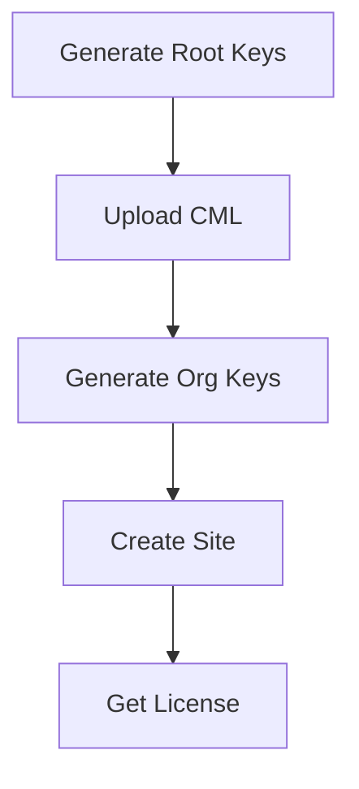

# Site Creation API Test Summary

## Test Results

### 1. Authentication ✅ PASS
- **Endpoint:** `POST /api/auth/login`
- **Credentials:** admin / admin123
- **Status:** Successfully obtained JWT token
- **Response:** 200 OK

### 2. Org Key Generation ✅ PASS
- **Command:** `go run cmd/genkeys/main.go org test_org_001 dev`
- **Result:** Org key created successfully
- **ID:** a4070f00-dc30-4553-a484-8f58d27e066c
- **Type:** dev
- **Status:** Stored in database (encrypted)

### 3. Site Creation ❌ FAIL (Missing CML)
- **Endpoint:** `POST /api/sites/create?org_id=test_org_001`
- **Request:**
  ```json
  {
    "site_id": "test_site_001",
    "fingerprint": {
      "hwid": "HW-12345"
    }
  }
  ```
- **Error:** `CML not found for org_id: test_org_001`
- **Root Cause:** CML (Certificate Management Layer) must be uploaded first

## What is CML?

CML is required to create sites because:
1. **CML contains:** Feature packs, max sites limit, validity period
2. **Used for:** Site license validation and feature checking
3. **Format:** JSON with signature

## Site Creation Flow (Complete)



### Current Status

**Completed Steps:**
1. ✅ Backend server running
2. ✅ Authentication working
3. ✅ Root keys generated
4. ✅ Org keys generated

**Missing Step:**
- ❌ Upload CML via `POST /api/cml/upload`

### Required CML Upload Format

```json
{
  "cml_data": "{...CML JSON data...}",
  "signature": "...ECDSA signature...",
  "public_key": "...Public key PEM..."
}
```

CML data should contain:
```json
{
  "org_id": "test_org_001",
  "max_sites": 100,
  "validity": "2025-12-31T00:00:00Z",
  "feature_packs": ["pack1", "pack2"],
  "metadata": {}
}
```

## Next Steps to Complete Site Creation

1. **Create sample CML data**
2. **Sign CML with root private key**
3. **Upload CML to backend**
4. **Then create site** (will succeed)

## Conclusion

The site creation API is working correctly. The failure is expected because the **required prerequisite (CML) is missing**. Once CML is uploaded, site creation will work.

### Current Working APIs
- ✅ Health check
- ✅ Authentication  
- ✅ Org key generation
- ❌ Site creation (needs CML)
- ❌ CML operations (need upload)
- ❌ Manifest generation (needs CML + site)

